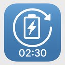

#  Chargi

Chargi is a minimal, focused macOS menu bar app that shows charging status and time remaining, with a floating bubble and a widget. It’s lightweight, private, and stays out of your way.

## Features

- Menu bar battery time or icon with charging pulse
- Floating bubble window with status and quick hide/quit
- Home Screen widget for time remaining
- Cache tools with auto-clean rules
- Modern app icon with rotate, clock, and bolt

## Install

1. Build the app bundle and DMG:
   - `zsh scripts/package_app.sh`
2. Open the DMG and drag `Chargi.app` to `Applications`.

## Usage

- Launch Chargi; it runs as a background agent (`LSUIElement`) without a Dock icon.
- Use the menu bar icon:
  - Toggle `Floating Bubble`
  - Toggle `Widget Content`
  - Toggle `Show Time In Menu Bar`
  - `Quit`
- Right‑click the floating bubble for quick `Hide Bubble` and `Quit`.

## Building

### Prerequisites
- macOS with Xcode Command Line Tools installed (`xcode-select --install`).
- Uses built‑in macOS tools: `xcodebuild`, `iconutil`, `hdiutil`.

### Quick Build (no Xcode project)
- Run: `zsh scripts/package_app.sh`
- Produces:
  - App: `dist/Chargi.app`
  - DMG: `dist/Chargi.dmg`
- Open the app: `open dist/Chargi.app`

### Build With Xcode (includes widget extension)
- Create an Xcode project/workspace and add a Widget Extension target.
- In both App and Widget targets, enable App Group `group.chargi.app` under Signing & Capabilities.
- Build via script (it auto‑detects project/workspace and copies `.appex`):
  - `SCHEME=Chargi PROJECT=Chargi.xcodeproj zsh scripts/package_app.sh`
  - or `SCHEME=Chargi WORKSPACE=Chargi.xcworkspace zsh scripts/package_app.sh`
- Optional: `CONFIGURATION=Release` (default is `Release`).
- Outputs:
  - App: `build/XcodeDerived/Build/Products/Release/Chargi.app`
  - DMG: `dist/Chargi.dmg`

### Script Behavior
- Icon preparation: converts PNGs into `.icns` and embeds in the bundle.
  - Preferred: place PNGs in `AppIcon.appiconset/` (e.g., `icon-16.png`, `icon-32.png`, `icon-64.png`, `icon-128.png`, `icon-256.png`, `icon-512.png`, `icon-1024.png`).
  - Also supported: `Assets.xcassets/AppIcon.appiconset/` or `Assets/AppIcon.iconset/`.
  - If assets are missing, the script attempts to generate icons programmatically.
- Packaging: builds the app, copies any `.appex` (widget) into `Contents/PlugIns/`, and creates the DMG with an `/Applications` link.

### Script Variables
- `SCHEME`: Xcode scheme to build (default `Chargi`).
- `PROJECT`: `.xcodeproj` path.
- `WORKSPACE`: `.xcworkspace` path.
- `CONFIGURATION`: `Release` or `Debug` (default `Release`).

## Icons

- If `Resources/AppIcon.icns` is missing, the script generates a modern icon from vectors and bundles it.
- Runtime also sets a fallback drawn icon.

## Privacy

- Chargi runs locally and does not send data anywhere.

## Uninstall

- Quit the app, then remove `Applications/Chargi.app`.
